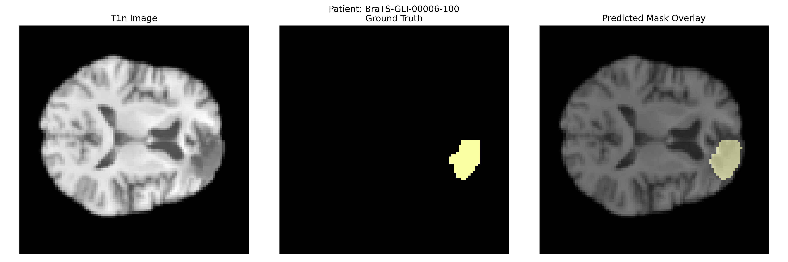

# 🧠 Brain Tumor Segmentation



An AI application that uses deep learning to automatically predict and segment brain tumors from MRI scans. This tool helps medical professionals visualize and analyze brain tumors using state-of-the-art AI technology.

[Try it out](https://sanskarmodi8-brain-tumor-segmentation-app-v4gu5u.streamlit.app/)

## ✨ Features

- **Multi-Modal MRI Processing**: Analyzes all four standard MRI modalities (T1, T1c, T2, FLAIR)
- **Advanced Visualization**: Interactive views with adjustable slices and tumor overlays
- **Detailed Tumor Statistics**: Volume measurements and tissue class breakdown
- **3D Visualization**: Axial, Coronal, and Sagittal views
- **User-Friendly Interface**: Simple upload and processing workflow

## 🛠️ Technology Stack

- **Frontend/UI**: Streamlit
- **Deep Learning Model**: Swin UNETR
- **Medical Imaging**: MONAI, NiBabel
- **Data Processing**: PyTorch, NumPy
- **Visualization**: Matplotlib

## 📦 Data Information

This project uses the **BraTS 2024 Challenge - Glioma (GLI) dataset**, which includes multi-institutional, multi-modal MRI scans for brain tumor segmentation.

* **Source**: [BraTS 2024 GLI Challenge](https://www.synapse.org/#!Synapse:syn36649257/wiki/)
* **Data Used**:

  * **Training Set** and **Additional Training Set** from the GLI task.
* **Modalities**:

  * `T1n` – T1-weighted without contrast
  * `T1c` – T1-weighted with contrast enhancement
  * `T2w` – T2-weighted
  * `T2f` – T2-FLAIR
  * `seg` – Ground truth segmentation mask

### 🗂️ Data Preparation

After downloading, all patient folders were moved into a single directory:

```
artifacts/data/
```

* Total dataset size: **\~40 GB**
* Each patient folder contains 5 `.nii.gz` files named in the format:

  ```
  BraTS-GLI-XXX-{modality}.nii.gz
  ```

### 🔀 Data Splits

The dataset was randomly split into:

| Split | %   | Description                         |
| ----- | --- | ----------------------------------- |
| Train | 70% | Used for model training             |
| Val   | 15% | Used for validation during training |
| Test  | 15% | Used for final evaluation           |


## 📋 Installation

### Prerequisites

- Python 3.8+
- CUDA-compatible GPU recommended for faster processing

### Setup

1. Clone the repository:
   ```bash
   git clone https://github.com/sanskarmodi8/brain_tumor_segmentation.git
   cd brain_tumor_segmentation
   ```

2. Create and activate a virtual environment:
   ```bash
   python -m venv venv
   source venv/bin/activate  # On Windows: venv\Scripts\activate
   ```

3. Install dependencies:
   ```bash
   pip install -r requirements.txt
   ```

4. Download the BraTS GLI Dataset, move all patient folders into a single directory `artifacts/data` at the root level of the project.

## 🚀 Usage

### For running the pipeline (Preprocessing, Training, Evaluation):

```bash
dvc init --force
dvc repro
```

### For running the application:

1. Start the Streamlit app:
   ```bash
   streamlit run app.py
   ```

2. Access the web interface at http://localhost:8501

3. Upload all four required MRI modalities:
   - T1n: T1-weighted without contrast
   - T1c: T1-weighted with contrast
   - T2w: T2-weighted
   - T2f: T2-FLAIR

4. Wait for the segmentation to complete and explore the results

## 📂 Project Structure

```
brain_tumor_segmentation/
├── app.py                             # Streamlit application
├── Brain_Tumor_Segmentation_Report_Detailed_Expanded.docx
├── config
│   └── config.yaml                    # Configuration settings
├── demo_result.png                    # Demo image for README
├── dvc.lock
├── dvc.yaml                           # DVC pipeline configuration
├── format.sh
├── LICENSE
├── logs
│   └── running_logs.log
├── main.py                            # Entry point for the application
├── params.yaml                        # Model parameters
├── Project Overview.pptx
├── pyproject.toml
├── README.md
├── requirements.txt
├── src
│   └── BrainTumorSegmentation         # Main package
│       ├── components                 # Core components
│       │   ├── data_preprocessing.py
│       │   ├── model_evaluation.py
│       │   └── model_training.py
│       ├── config                     # Configuration utilities
│       │   └── configuration.py
│       ├── constants
│       ├── entity                     # Data entities
│       │   └── config_entity.py
│       ├── pipeline                   # Pipeline stages
│       │   ├── prediction.py
│       │   ├── stage_01_data_preprocessing.py
│       │   ├── stage_02_model_training.py
│       │   └── stage_03_model_evaluation.py
│       └── utils                      # Utility functions
│           └── common.py
└── trials
    ├── notebook.ipynb                 # Development notebook
    └── swin_unetr_model.pth           # model
```

## 📊 Results

Our model achieves exceptional performance on brain tumor segmentation:

| Metric | Value |
|--------|-------|
| Average Loss | 0.0121 |
| Accuracy | 99.94% |
| Standard Deviation (Accuracy) | 0.076% |

## ⚕️ Medical Disclaimer

This application is intended for research and educational purposes only. It should not be used for clinical decision-making or as a replacement for professional medical advice, diagnosis, or treatment. Always seek the advice of your physician or other qualified health provider with any questions you may have regarding a medical condition.

## 🤝 Contributing

Contributions are welcome! Please feel free to submit a Pull Request.

1. Fork the repository
2. Create your feature branch (`git checkout -b feature/amazing-feature`)
3. Commit your changes (`git commit -m 'Add some amazing feature'`)
4. Push to the branch (`git push origin feature/amazing-feature`)
5. Open a Pull Request

## 📄 License

This project is licensed under the MIT License - see the [LICENSE](LICENSE) file for details.
